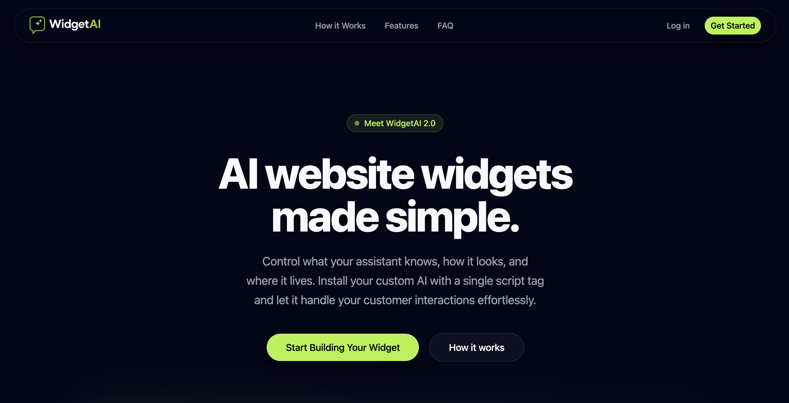

# WidgetAI Landing Page

Public landing page for WidgetAI, built with Astro, React, TypeScript, and Tailwind CSS.

WidgetAI is a product for creating embeddable AI chat widgets for websites. This repository contains only the marketing and landing page that presents the product. The dashboard, backend, embeddable widget runtime, and AI infrastructure are closed source and are not included here.



## Live URLs

- Landing page: [widgetai.youssef.tn](https://widgetai.youssef.tn)
- Hosted dashboard: [dashboard.widgetai.youssef.tn](https://dashboard.widgetai.youssef.tn/login)

## Repository Scope

This repository includes:

- The public homepage
- Product messaging and marketing sections
- Responsive navigation and mobile menu behavior
- Feature highlights and FAQ content
- SEO metadata, social sharing tags, structured data, sitemap support, and robots handling
- Public static assets such as logos, preview images, and favicons

This repository does not include:

- User authentication
- The private WidgetAI dashboard
- Backend APIs or database logic
- The embeddable chat widget runtime
- AI provider integrations or business logic

## Features

- Large hero section with product preview and primary calls to action
- "How it works" section that explains the widget setup flow
- Feature grid covering installation, customization, domain restrictions, AI configuration, and context control
- FAQ accordion with product-focused answers
- Conversion-focused final CTA and footer links
- Structured data for Organization, WebSite, WebPage, SoftwareApplication, and FAQPage
- Sitemap integration and canonical URL support
- Responsive layout across desktop and mobile

## Tech Stack

- Astro 5
- React 19
- TypeScript
- Tailwind CSS v4
- shadcn/ui
- Base UI
- ESLint
- Prettier

## Project Structure

```text
.
├── public/              # Images, previews, logos, favicons
├── src/
│   ├── components/      # React and UI components
│   ├── layouts/         # Shared Astro layout
│   ├── lib/             # Site config and shared helpers
│   ├── pages/           # Astro routes
│   └── styles/          # Global styles and theme tokens
├── astro.config.mjs
├── package.json
└── project-overview.txt
```

## Getting Started

### Prerequisites

- Bun 1.x

### Installation

```bash
bun install
```

### Run the development server

```bash
bun run dev
```

### Build for production

```bash
bun run build
```

### Preview the production build

```bash
bun run preview
```

## Available Scripts

- `bun run dev` - Start the local development server
- `bun run build` - Create a production build in `dist/`
- `bun run preview` - Preview the production build locally
- `bun run lint` - Run ESLint
- `bun run typecheck` - Run Astro and TypeScript checks
- `bun run format` - Format `*.ts`, `*.tsx`, and `*.astro` files

## Configuration

- `SITE_URL` or `PUBLIC_SITE_URL` can be used at build time to override the canonical site URL
- Core site metadata lives in `src/lib/site.ts`
- SEO output is handled through `src/layouts/main.astro` and `@astrojs/sitemap`

## Contributing

Contributions are welcome for the public landing page only. Good contribution areas include:

- Copy and messaging improvements
- Visual polish and responsive refinements
- Accessibility improvements
- Performance work
- SEO and metadata improvements

Please keep pull requests scoped to the open source landing page in this repository.

## Author

Built by Youssef Dhibi.

## License

This repository is licensed under the MIT License. See [LICENSE](LICENSE).

The MIT license applies only to the files contained in this repository. The private WidgetAI dashboard, backend services, embeddable runtime, and other closed source product components are not part of this repository or this license.
